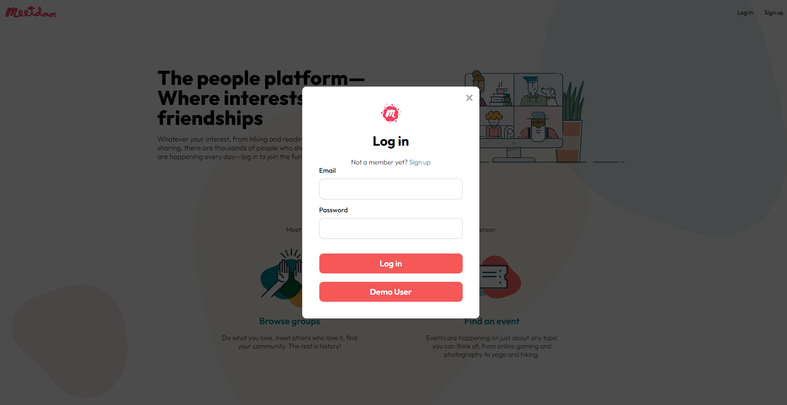
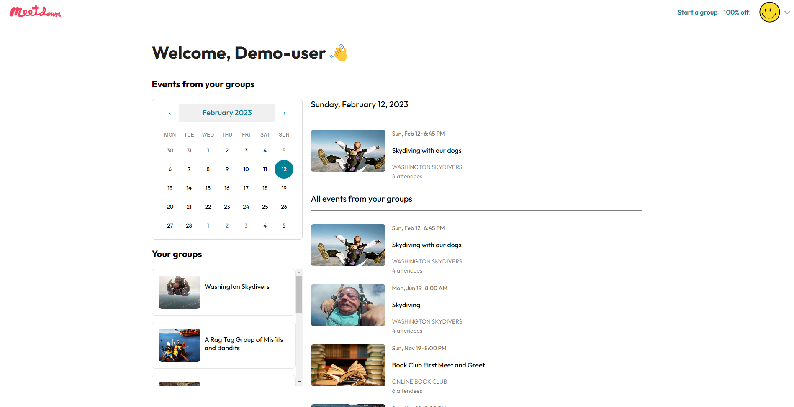
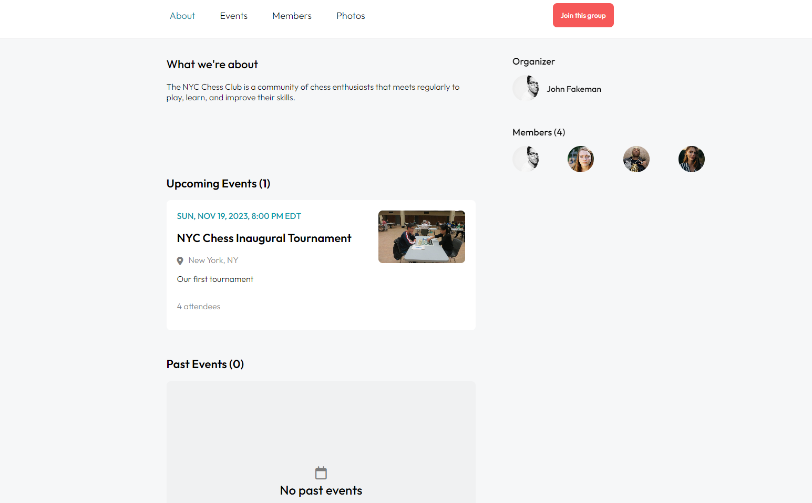
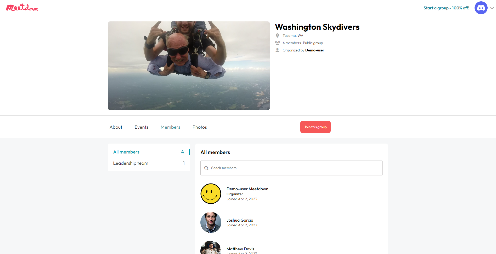
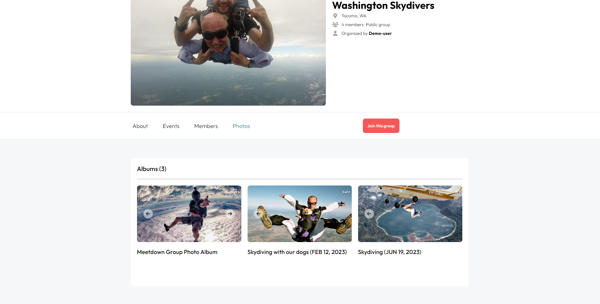

<br>

# About the project

A clone of [meetup.com](https://www.meetup.com/). Features include:

- Full CRUD on groups
- Full CRUD on group memberships (based on user status within the group)
- Image uploads for user profile pictures and groups
- Create/Read/Delete on events

## What I'm Most Proud Of

### Backend

I used Sequelize as the ORM for my backend and was able to avoid using N + 1 queries to load associated aggregate data, which can be very tricky especially when switching between Sqlite for development and PostgreSQL for deployment.

### Frontend

I'm proud of how closely this project resembles the actual site. The most challenging aspects were handling user permissions in the front end and managing all of the various date/time elements of the site.

## Highlights

### Splash page



### User home page



### Group "About" page



### Group "Members" page



### Group "Photos" page



## Upcoming features

- Functionality to request/approve/update attendance status for an event
- Ability to upload images for events
- Full CRUD on events

<br>

## [🔗 Live Site](https://meetdown.onrender.com/)

<br>

## Tech Stack 🥞

[](https://developer.mozilla.org/en-US/docs/Web/JavaScript)
[](https://developer.mozilla.org/en-US/docs/Web/HTML)
[](https://developer.mozilla.org/en-US/docs/Web/css)
[](https://reactjs.org/)
[](https://redux.js.org/)

[](https://expressjs.com/)
[](https://sequelize.org/)
[](https://www.postgresql.org/)

[](https://www.render.com/)
[](https://aws.amazon.com/pm/serv-s3/?trk=fecf68c9-3874-4ae2-a7ed-72b6d19c8034&sc_channel=ps&s_kwcid=AL!4422!3!536452728638!e!!g!!aws%20s3&ef_id=CjwKCAiA2rOeBhAsEiwA2Pl7Q6Zfh1RxX9qRTYsnbgE54_VrB3J2URKpsGLTGCGimZk9gYKtgiEfvhoCsmQQAvD_BwE:G:s&s_kwcid=AL!4422!3!536452728638!e!!g!!aws%20s3)

## Installation

1. git clone this repo
2. Install dependencies from the root directory
3. From the backend directory, rename .env.example to .env

- **Note**: AWS Image uploads will not work without `AWS_ACCESS_KEY_ID` and `AWS_SECRET_ACCESS_KEY` environment variables set

4. From the backend directory, run the "dbreset" script to initalize the database and populate it with seed data. (This script can be used any time you want to reset the database)

```
git clone https://github.com/hen-wood/meetup-clone.git && cd meetup-clone && npm install && cd backend && mv .env.example .env && npm run dbreset && npm start
```

6. In another terminal, start React from the frontend directory

```
cd frontend && npm start
```

7. Navigate to http://localhost:3000
